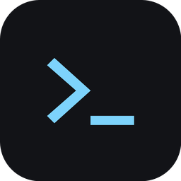

<p align="center">
  
</p>

<h1 align="center">aiterm</h1>

<h4 align="center">One workbench for every AI coding CLI you run — and your phone as a second screen for all of it.</h4>

<p align="center">
  <a href="https://github.com/jallisonfl/aiterm-upstream/releases/latest"></a>
  <a href="https://github.com/jallisonfl/aiterm-upstream/releases"></a>
  <a href="https://github.com/jallisonfl/aiterm-upstream/actions/workflows/build.yml"></a>
  
  
  <a href="LICENSE"></a>
</p>

<p align="center">
  <b>⬇️ <a href="https://github.com/jallisonfl/aiterm-upstream/releases/latest">Download</a></b> •
  <b>🌙 <a href="https://github.com/jallisonfl/aiterm-upstream/releases">Nightly</a></b> •
  <b>📱 <a href="https://github.com/jallisonfl/aiterm-upstream/wiki/Phone">Phone app</a></b> •
  <b>📖 <a href="https://github.com/jallisonfl/aiterm-upstream/wiki">Wiki</a></b> •
  <b>🛠️ <a href="https://github.com/jallisonfl/aiterm-upstream/wiki/Building-from-Source">Build it</a></b> •
  <b>🤝 <a href="CONTRIBUTING.md">Contribute</a></b>
</p>

<!-- hero screenshot: drop .github/assets/hero.png (desktop with a session open, ~1600px wide) and uncomment
<p align="center"></p>
-->

A real terminal in the middle. Everything the agent keeps on disk — sessions, files, diffs, tasks, usage — surfaced as UI around it. **The terminal is the terminal**: nothing about any CLI is reimplemented, so what you see cannot drift from what the agent is actually doing.

<br>

## 🚀 Get started

### Step 1: Download

Grab the [latest release](https://github.com/jallisonfl/aiterm-upstream/releases/latest) — AppImage, `.deb`, or `.rpm` for the desktop, plus the phone APK. Linux-first; the stack is cross-platform but other platforms are untested.

### Step 2: Sign in to the CLIs you use

aiterm drives the real tools and reads their state from where they already keep it. An engine that isn't installed simply isn't offered.

### Step 3: Pair your phone (optional)

Settings → Remote access → **Turn on** → **Pair** → scan the QR. One pairing covers every road. Off by default; nothing is written until you turn it on.

<br>

## 🧠 Engines

<table>
  <tr>
    <td align="center" width="110"><br><b>Claude Code</b></td>
    <td align="center" width="110"><br><b>Codex</b></td>
    <td align="center" width="110"><br><b>Grok</b></td>
    <td align="center" width="110"><br><b>OpenCode</b></td>
    <td align="center" width="110"><br><b>Antigravity</b></td>
    <td align="center" width="110"><br><b>OpenRouter</b></td>
    <td align="center" width="110"><br><b>Any API</b></td>
    <td align="center" width="110"><br><b>Local models</b></td>
  </tr>
</table>

| Engine | What you get |
|---|---|
| **Claude Code** | New session in any folder, resume, instant fork (no process needed), rename, trash with undo. `/model`, `/rewind`, permission prompts and "Switch model?" become real keyboard-first dialogs. Plan-limit usage bars and per-session context fill. |
| **Codex** | List, resume, fork. Tasks and generated-image artifacts read from Codex's own files. Credits from the ChatGPT usage endpoint. |
| **Grok** | Sessions with an aiterm-minted id (row appears on the first frame), resume from any folder, titles and model from Grok's own summary, image artifacts. |
| **OpenCode** | Sessions read from OpenCode's SQLite store, launched from the same start menu, local providers resolved from `opencode.json`. |
| **Antigravity** | Conversations with agy's own titles and transcripts; resume; usage bars. |
| **API + local models** | Any OpenAI-compatible base URL — OpenRouter, OpenAI, Together, Groq, vLLM, llama.cpp. Add a key, test it, pick a shortlist, chat in a tab like any CLI. Keys live in a 0600 file and never touch argv. |

Every engine feeds one live event stream, the [spine](docs/architecture/spine.md), so the sidebar, fleet board and phone read one vocabulary no matter which CLI is underneath. Adding an engine is one adapter, written against [HARNESS-CONTRACT.md](docs/architecture/HARNESS-CONTRACT.md).

<br>

## 🔥 Why aiterm

- 🧭 **The truth lives on disk, not in a copy.** State is read from transcripts, config and the drawn screen, so the UI cannot drift from what the CLI is doing.
- 🔒 **Closed-loop, never guessing.** When aiterm drives a TUI (model picker, rewind, permission prompt), every keystroke is verified against what the TUI drew. It refuses rather than lies.
- 🧩 **Multi-engine by design.** One sidebar, one search index, one fleet board, one phone view — across every CLI you run.
- 📱 **Your phone is a real client.** Four transports, pinned TLS, no third party in the middle, off by default.
- ⚡ **Instant forks.** Copy the transcript, rewrite its ids, and a resumable branch exists before any process starts.
- 🚦 **A fleet board that says what each session needs right now** — blocked on a permission, mid-tool, how long the turn has been open — not just when it last moved.

<br>

## 🗂️ Sessions

- **Sidebar** — every session from every engine, grouped by project or date, full-text searchable. Star, rename, fork, preview, trash/restore.
- **Hover card** — rest on a row: opening ask, last exchange, duration, model, mode, context used, tools, files.
- **Home dashboard** — a prompt box with engine/model/effort (type, Enter, the session opens already working) and the **Fleet board**.
- **File tabs** — browser-style strip; the terminal locked on the left, files beside it in a CodeMirror editor with a save-conflict guard so an agent's concurrent write is never clobbered.
- **Previews** — Markdown live from the buffer, HTML as the real page in a sandboxed iframe, PDFs page by page.
- **Panels** — explorer, git (branches, log, per-file diffs on filesystem events), agent tasks and artifacts.
- **Bring in a crew** — pull a second agent (any engine, API or local model) into a live session; choose how long it stays. Five relay prompts, all editable.
- **Librarian** — a cheap model names the sessions the engine didn't; runs on an installed CLI's print mode (no extra spend) or an API provider. Hand-set names always win.
- **Attention** — bell, desktop notifications in the session's own words, taskbar badge, tray alert menu.
- **Changes ledger** — every file an agent created, modified or deleted, attributed to the session, persistent across restarts.

<br>

## 📱 Phone

<!-- phone screenshots: drop .github/assets/phone-1.png … phone-3.png (portrait, ~400px wide) and uncomment
<p align="center">
  &nbsp;&nbsp;
  &nbsp;&nbsp;
  
</p>
-->

Pair once by QR (single-use secret, 5-minute expiry, certificate fingerprint pinned before the phone sends anything, device approved on the desktop).

| Road | When it's used |
|---|---|
| 🏠 **LAN** | same network |
| 🔐 **VPN** | Tailscale / WireGuard, MagicDNS names included |
| 🛰️ **Relay** | blind SNI-routed relay when neither side is reachable — self-hostable from [`relay/server`](relay/server) |
| 🌐 **iroh** | peer-to-peer QUIC with relay fallback, no server of ours |

Any set of roads on at once, tried in an order you can reorder from either end.

On the phone: read any session as a conversation (markdown, tool cards, tappable file chips, live streaming), send input, interrupt, stop, rename, answer permission dialogs, bring in a second agent, start a new session in any desktop folder, browse and preview what the agent produced (images, video, text, PDF, live web preview), open a plain desktop shell, search and filter the fleet, usage strip, themes, biometric lock.

The phone never receives PTY bytes for agent sessions, never reads a transcript, never owns a process. It asks the desktop.

<br>

## ⚙️ Settings

Appearance (8 themes, accent, icon size, time zone, per-panel scale) · Fonts (UI + terminal, GPU/DOM renderer, install from file) · Agents · Model access · Librarian · Bring in · Remote access · Diagnostics.

<br>

## 📦 Project layout

| Path | What it is |
|---|---|
| [`src/`](src) | Desktop UI — React, xterm.js, CodeMirror |
| [`src-tauri/`](src-tauri) | Desktop backend — Rust, Tauri 2: engines, sessions, spine, remote |
| [`mobile/`](mobile) | The phone app — Kotlin, Jetpack Compose |
| [`relay/server`](relay/server) | The blind transport relay, self-hostable |
| [`relay/protocol`](relay/protocol) | The crate the desktop, the relay and the gateway client share |
| [`relay/gateway-android`](relay/gateway-android) | Android client for the desktop's Gateway listener |
| [`docs/`](docs) | Architecture, remote roads, dated design specs and plans |

<br>

## 🛠️ Build from source

```bash
npm install
npm run tauri dev                              # desktop, hot reload
npm run tauri build -- --bundles appimage,deb  # release build
cd mobile && ./gradlew assembleDebug           # phone APK
```

Prerequisites, sysctl notes and the test commands are on the wiki: [Building from Source](https://github.com/jallisonfl/aiterm-upstream/wiki/Building-from-Source).

<br>

## 🔁 Releases

Releases are tags, never branches. Every push to `5lime-dev` builds; every evening becomes a nightly; `scripts/release.sh alpha|beta|final X.Y.Z` cuts a staged or stable version and CI publishes it with AppImage, deb, rpm and the phone APK. Details: [Releases and Versioning](https://github.com/jallisonfl/aiterm-upstream/wiki/Releases-and-Versioning).

```
5lime-dev     where everything happens — one commit per feature, pushed as you go
main          stable — moves only when a version is cut, tagged vX.Y.Z
release/X.Y   only while a beta is being stabilised
```

<br>

## 📚 Documentation & contributing

- 📖 [Wiki](https://github.com/jallisonfl/aiterm-upstream/wiki) — the user manual: install, engines, phone, settings, troubleshooting
- 🏗️ [docs/](docs) — [session model](docs/architecture/SESSION-MODEL.md), [spine](docs/architecture/spine.md), [harness contract](docs/architecture/HARNESS-CONTRACT.md), [remote roads](docs/remote/remote-roads.md)
- 🤝 [CONTRIBUTING.md](CONTRIBUTING.md) — how work lands, commit voice, release commands
- 🎨 Brand marks from the [LobeHub icon set](https://lobehub.com/icons) (MIT), vendored under `src/assets/icons`; refresh with `node scripts/sync-icons.mjs`

<br>

## License

Source-available, not open source. Free to build, run and modify for your own use, at home or at work; it may not be sold, offered as a service, or redistributed. See [LICENSE](LICENSE).
